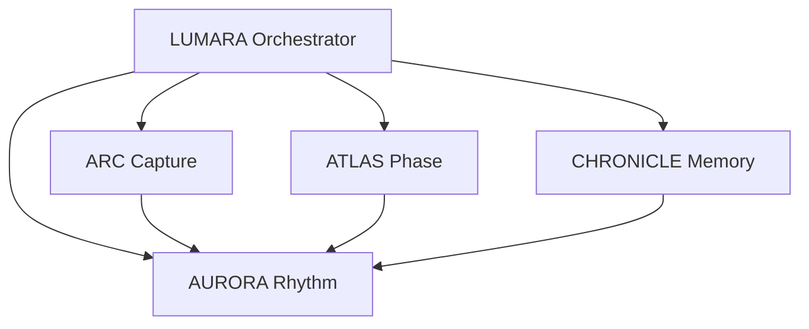

# CHRONICLE Context for Claude

**Purpose:** Full context to implement (or plan) the rename from Polymeta to CHRONICLE. CHRONICLE does not exist yet as the named memory subsystem; we are planning to change Polymeta to CHRONICLE.

**Audience:** Claude (or any AI) implementing or planning this change.

**Last updated:** February 2026

---

## 1. Purpose and Audience

This document gives Claude full context to implement or plan the rename from **Polymeta** to **CHRONICLE**.

- **CHRONICLE does not exist yet** as the named memory subsystem.
- **We are planning to change Polymeta to CHRONICLE** — i.e. introduce CHRONICLE by renaming/replacing the current "Polymeta" memory subsystem.

Use this file as the single source of truth for current state, target architecture, and implementation scope.

---

## 2. Current State (What Exists Today)

### Polymeta in Documentation

Today "Polymeta" is referenced as **Stage 2** of the two-stage memory system: **Context Selection + Polymeta**.

| Document | Path | Polymeta reference |
|----------|------|--------------------|
| claude.md | `DOCS/claude.md` | Two-stage memory (Context Selection + Polymeta); Polymeta `MemoryModeService`; Memory Mode Settings = Polymeta domain modes |
| LUMARA_COMPLETE.md | `DOCS/LUMARA_COMPLETE.md` | Two-stage memory (Context Selection + Polymeta); Polymeta synthesizes patterns across retrieved entries |
| ARCHITECTURE.md | `DOCS/ARCHITECTURE.md` | Stage 2: Polymeta Memory Filtering; Context Selector → Polymeta filters memories |
| LUMARA_Vision.md | `DOCS/LUMARA_Vision.md` | Polymeta Memory |
| DOCUMENTATION_CONSOLIDATION_AUDIT_REPORT.md | `DOCS/archive/DOCUMENTATION_CONSOLIDATION_AUDIT_REPORT.md` | Two-stage memory (Context Selection + Polymeta) |
| Backlog.md | `DOCS/archive/Backlog.md` | Polymeta/Semantic Memory Stress |

### Polymeta in Code

| Component | Path | Role |
|-----------|------|------|
| **MemoryModeService** | `lib/mira/memory/memory_mode_service.dart` | Domain-based semantic memory filtering (Stage 2) |
| **LumaraContextSelector** | `lib/arc/chat/services/lumara_context_selector.dart` | Stage 1: entry selection; comments reference Polymeta (MemoryModeService) as Stage 2 |
| **Enhanced LUMARA API** | `lib/arc/chat/services/enhanced_lumara_api.dart` | Uses context selector then memory filtering (Polymeta) |
| **Memory Mode Settings UI** | `lib/shared/ui/settings/memory_mode_settings_view.dart` | "Memory Mode" / Polymeta domain modes |
| **Lumara Master Prompt** | `lib/arc/chat/llm/prompts/lumara_master_prompt.dart` | String: "Polymeta memory" (line ~1553) |
| **Lumara Profile (JSON)** | `lib/arc/chat/prompts/lumara_profile.json` | Keys: `polymeta_context`, `polymeta_insights`, `missing_polymeta`, `polymeta_rules` |
| **Chat Multimodal Processor** | `lib/mira/store/mcp/orchestrator/chat_multimodal_processor.dart` | Comment: moved to `polymeta/store/mcp/` during consolidation |

### Note on `lib/chronicle/`

The repo **already has** a `lib/chronicle/` package:

- **Query:** `ChronicleQueryRouter`, `ChronicleContextBuilder`, `DrillDownHandler` (`lib/chronicle/query/`)
- **Synthesis:** `SynthesisEngine`, `MonthlySynthesizer`, `YearlySynthesizer`, `MultiyearSynthesizer` (`lib/chronicle/synthesis/`)
- **Storage:** `Layer0Repository`, `AggregationRepository`, `ChangelogRepository` (`lib/chronicle/storage/`)
- **Scheduling:** `SynthesisScheduler`, VEIL integration (`lib/chronicle/scheduling/`, `lib/chronicle/integration/`)
- **Models:** `ChronicleLayer`, `ChronicleAggregation`, `QueryPlan` (`lib/chronicle/models/`)

There is **no** Dart `Subsystem` interface or LUMARA subsystem router in code yet.

**Scope for Claude:** Either (a) treat `lib/chronicle/` as the implementation that will be exposed as CHRONICLE once Polymeta is renamed and the subsystem wrapper is added, or (b) treat CHRONICLE as a greenfield name and describe how Polymeta (MemoryModeService) and existing chronicle code relate to the target CHRONICLE subsystem.

---

## 3. Target State: Corrected Architecture

### The Four-Subsystem Spine



```
                    LUMARA (Orchestrator)
                           |
        ┌──────────────────┼──────────────────┐
        |                  |                  |
    ┌───▼───┐         ┌────▼────┐       ┌────▼────┐
    │  ARC  │         │  ATLAS  │       │CHRONICLE│
    │Capture│         │  Phase  │       │ Memory  │
    └───┬───┘         └────┬────┘       └────┬────┘
        |                  |                  |
        └──────────────────┼──────────────────┘
                           |
                      ┌────▼────┐
                      │ AURORA  │
                      │ Rhythm  │
                      └─────────┘
```

**The four subsystems:**

1. **ARC** - Narrative Capture & Reflection
2. **ATLAS** - Developmental Phase Intelligence
3. **CHRONICLE** - Longitudinal Memory & Context
4. **AURORA** - Rhythm & Regulation

### What CHRONICLE Is

CHRONICLE is both the **subsystem interface** (what LUMARA sees) and the **complete implementation** (hierarchical temporal aggregation).

#### As a Subsystem (Interface)

**What it answers:** "How has this shown up before, and how did it evolve?"

**What LUMARA can query:**

- Retrieve aggregations (weekly, monthly, yearly, multi-year)
- Pattern analysis across time
- Theme evolution tracking
- Historical precedents for current situations
- Temporal comparisons (this month vs. last year)

**Standard interface (target):**

```dart
class ChronicleSubsystem implements Subsystem {
  @override
  Future<SubsystemResult> query(CommandIntent intent) async {
    // Route query to appropriate aggregation layers
    // Return temporal intelligence
  }

  @override
  bool canHandle(CommandIntent intent) {
    // Can handle: temporal queries, pattern analysis,
    // developmental trajectories, historical parallels
  }

  @override
  String get name => 'CHRONICLE';
}
```

#### As an Implementation (The Architecture)

CHRONICLE implements longitudinal memory through:

**1. Hierarchical Storage (The Layers)**

```
Layer 0: Raw Entry Storage (Hive)
  └─> Layer 1: Weekly/Monthly Aggregations (Markdown)
        └─> Layer 2: Yearly Aggregations (Markdown)
              └─> Layer 3: Multi-Year Meta-Patterns (Markdown)
```

**2. Synthesis Engine (The Intelligence)**

- **VeilChronicleScheduler** - Nightly synthesis runs
- **MonthlySynthesizer** - Layer 0 → Layer 1 (VEIL "Examine" stage)
- **YearlySynthesizer** - Layer 1 → Layer 2 (VEIL "Integrate" stage)
- **MultiYearSynthesizer** - Layer 2 → Layer 3 (VEIL "Link" stage)

**3. Query System (The Router)**

- **ChronicleQueryRouter** - Intent classification, layer selection
- **ChronicleContextBuilder** - Load and format aggregations
- **DrillDownHandler** - Navigate between layers

**4. Collaborative Intelligence (The Co-Creation)**

- **User Editing System** - Version control for aggregations
- **Edit Propagation** - User edits trigger dependent re-synthesis
- **Narrative Authority** - User-edited sections have higher weight

**5. Supporting Infrastructure**

- **ChronicleBackfillService** - Rapid population for existing users
- **UniversalImporter** - Import from other journaling apps
- **SENTINEL integration** - Emotional density tracking
- **RIVET integration** - Transition detection
- **PRISM integration** - Privacy preservation

### Supporting Systems Are Not Subsystems

**SENTINEL, RIVET, PRISM** are not subsystems. They are supporting infrastructure used by other subsystems:

- **SENTINEL** - Used by ATLAS (phase detection) and CHRONICLE (emotional density in aggregations)
- **RIVET** - Used by ATLAS (transition detection) and CHRONICLE (inflection points)
- **PRISM** - Used by CHRONICLE (privacy before cloud queries) and potentially AURORA (anonymized usage data)

They do not have direct query interfaces from LUMARA; they are internal services.

### Target File Structure

```
lib/
├── lumara/
│   ├── orchestrator/
│   │   ├── lumara_orchestrator.dart
│   │   ├── command_parser.dart
│   │   ├── subsystem_router.dart
│   │   ├── result_aggregator.dart
│   │   └── enterprise_formatter.dart
│   ├── subsystems/
│   │   ├── subsystem.dart              # Abstract interface
│   │   ├── arc_subsystem.dart
│   │   ├── atlas_subsystem.dart
│   │   ├── chronicle_subsystem.dart     # Wraps CHRONICLE
│   │   └── aurora_subsystem.dart
│   └── models/
│       ├── command_intent.dart
│       ├── query_plan.dart
│       ├── subsystem_result.dart
│       └── lumara_response.dart
├── chronicle/                          # CHRONICLE implementation (exists)
│   ├── chronicle_service.dart
│   ├── query/
│   │   ├── chronicle_query_router.dart
│   │   ├── chronicle_context_builder.dart
│   │   └── drill_down_handler.dart
│   ├── storage/
│   ├── synthesis/
│   ├── editing/
│   ├── migration/
│   └── models/
├── arc/
├── atlas/
├── sentinel/
├── rivet/
├── prism/
└── aurora/
```

### ChronicleSubsystem (Clean Interface)

```dart
class ChronicleSubsystem implements Subsystem {
  final ChronicleQueryRouter _router;
  final ChronicleContextBuilder _contextBuilder;
  final ChronicleService _chronicleService;

  @override
  Future<SubsystemResult> query(CommandIntent intent) async {
    final queryPlan = await _router.route(query: intent.rawQuery);
    final context = await _contextBuilder.buildContext(queryPlan);
    return SubsystemResult(
      source: 'CHRONICLE',
      data: context,
      metadata: {
        'layers': queryPlan.layers.map((l) => l.toString()).toList(),
        'compression_ratio': _calculateCompression(context),
        'user_edited': _hasUserEdits(context),
      },
    );
  }

  @override
  bool canHandle(CommandIntent intent) {
    switch (intent.type) {
      case IntentType.temporalQuery:       // "Show me January"
      case IntentType.patternAnalysis:     // "Analyze recurring themes"
      case IntentType.developmentalArc:    // "How have I changed?"
      case IntentType.historicalParallel:  // "Have I faced this before?"
      case IntentType.comparison:          // "Compare 2024 vs 2025"
        return true;
      default:
        return false;
    }
  }

  @override
  String get name => 'CHRONICLE';
}
```

---

## 4. Rename and Scope

### Docs and User-Facing Strings

- Replace **"Polymeta"** with **"CHRONICLE"** wherever Polymeta denotes the memory subsystem.
- Two-stage memory wording: "Context Selection + Polymeta" → "Context Selection + CHRONICLE" (or keep Context Selection as Stage 1 and CHRONICLE as Stage 2 memory).

### Code

- **MemoryModeService:** Decide whether it stays as internal implementation used by CHRONICLE (e.g. "CHRONICLE uses MemoryModeService for domain filtering") or is refactored/renamed into chronicle.
- **Comments and strings:** Update all Polymeta references in the files listed in Section 2.

### Prompts

- **lumara_master_prompt.dart:** "Polymeta memory" → "CHRONICLE memory" (or equivalent).
- **lumara_profile.json:** `polymeta_context` → `chronicle_context`, `polymeta_insights` → `chronicle_insights`, `missing_polymeta` → `missing_chronicle`, `polymeta_rules` → `chronicle_rules`. Ensure any downstream code or prompts that read these keys are updated.

### Affected Files (from grep)

| File | Action |
|------|--------|
| `DOCS/claude.md` | Polymeta → CHRONICLE in memory system description |
| `DOCS/ARCHITECTURE.md` | Stage 2 Polymeta → CHRONICLE |
| `DOCS/LUMARA_COMPLETE.md` | Two-stage memory + Polymeta → CHRONICLE |
| `DOCS/LUMARA_Vision.md` | Polymeta Memory → CHRONICLE Memory |
| `DOCS/archive/DOCUMENTATION_CONSOLIDATION_AUDIT_REPORT.md` | Two-stage memory wording |
| `DOCS/archive/Backlog.md` | Polymeta/Semantic → CHRONICLE/Semantic or similar |
| `lib/arc/chat/llm/prompts/lumara_master_prompt.dart` | "Polymeta memory" → "CHRONICLE memory" |
| `lib/arc/chat/services/lumara_context_selector.dart` | Comments: Polymeta → CHRONICLE |
| `lib/arc/chat/prompts/lumara_profile.json` | polymeta_* keys → chronicle_* |
| `lib/mira/store/mcp/orchestrator/chat_multimodal_processor.dart` | Comment path: polymeta/store/mcp/ → chronicle or leave as historical |

---

## 5. Implementation Checklist (for Claude)

1. **Documentation**
   - [ ] Update all Polymeta references in `DOCS/` (claude.md, ARCHITECTURE.md, LUMARA_COMPLETE.md, LUMARA_Vision.md, archive as needed).

2. **Code comments and strings**
   - [ ] `lumara_context_selector.dart`: Stage 2 comments Polymeta → CHRONICLE.
   - [ ] `lumara_master_prompt.dart`: "Polymeta memory" → "CHRONICLE memory".
   - [ ] `chat_multimodal_processor.dart`: Update or note comment (polymeta path).

3. **Prompts and JSON**
   - [ ] `lumara_profile.json`: Rename `polymeta_context`, `polymeta_insights`, `missing_polymeta`, `polymeta_rules` to chronicle_* equivalents; update any logic that references these keys.

4. **Subsystem interface (if in scope)**
   - [x] Add `Subsystem` interface (e.g. `lib/lumara/subsystems/subsystem.dart`).
   - [x] Add `ChronicleSubsystem` wrapping ChronicleQueryRouter, ChronicleContextBuilder.
   - [x] Add LUMARA orchestrator/subsystem router (`lib/lumara/orchestrator/`); wire in `EnhancedLumaraApi` behind `FeatureFlags.useOrchestrator`.
   - [x] Add `ArcSubsystem` wrapping LumaraContextSelector for recent journal entries; register with orchestrator.

5. **Relationship**
   - [ ] Clarify in docs/code: MemoryModeService vs CHRONICLE (e.g. "CHRONICLE uses MemoryModeService for domain filtering" or "CHRONICLE replaces Polymeta; MemoryModeService is refactored into chronicle/").

---

## 6. Soundness and Caveats

- **ARCHITECTURE.md** currently describes a **5-module** layout (ARC, PRISM, MIRA, AURORA, ECHO). The target is a **4-subsystem spine** under LUMARA (ARC, ATLAS, CHRONICLE, AURORA). When updating docs, align with the target spine and note the distinction (e.g. ECHO/PRISM/MIRA as supporting or legacy names).
- **Orchestrator and ChronicleSubsystem** exist in `lib/lumara/` (orchestrator, subsystems/chronicle_subsystem.dart). **ArcSubsystem** (arc/chat/services/arc_subsystem.dart) provides recent journal context. Integration in `EnhancedLumaraApi` is behind `FeatureFlags.useOrchestrator` (default false).
- **Existing `lib/chronicle/`** already implements query router, context builder, synthesis, and layers 0–3. The rename Polymeta → CHRONICLE primarily affects naming in docs, prompts, and LUMARA-facing concepts; the chronicle package can remain the CHRONICLE implementation and optionally be wrapped by ChronicleSubsystem when the Subsystem interface is introduced.

---

## Summary

| Item | Detail |
|------|--------|
| **CHRONICLE** | Does not exist yet as the named memory subsystem; we are introducing it by changing Polymeta to CHRONICLE. |
| **Polymeta today** | Docs: two-stage memory (Context Selection + Polymeta). Code: MemoryModeService, memory_mode_settings_view, lumara_context_selector, enhanced_lumara_api; prompts: lumara_master_prompt.dart, lumara_profile.json. |
| **Deliverable** | This .md gives Claude full context: current Polymeta (docs + code paths), target CHRONICLE architecture, rename scope, and implementation checklist. |
| **Existing lib/chronicle/** | Documented here; treat as the implementation to expose as CHRONICLE once Polymeta is renamed and (optionally) ChronicleSubsystem is added. |

**Related documents:** [MASTER_PROMPT_CONTEXT.md](MASTER_PROMPT_CONTEXT.md) – how the LUMARA master prompt affects chat, conversations (journal reflections), and voice mode.
