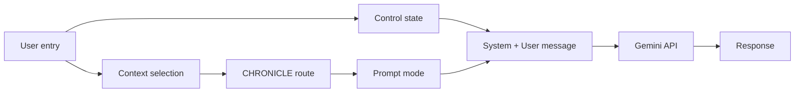
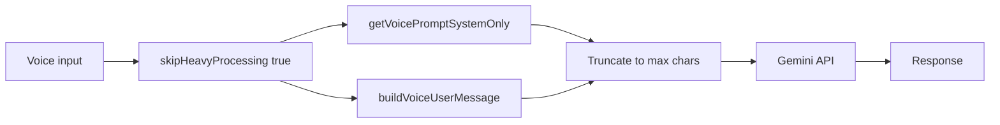

# LUMARA Master Prompt: Context for Chat, Conversations, and Voice

**Purpose:** Single reference for how the LUMARA master prompt works and how it affects **chat**, **conversations** (journal reflections), and **voice mode**.

**Audience:** Claude, developers, and implementers working on LUMARA or the CHRONICLE retool.

**Last updated:** February 2026

---

## 1. Purpose and Audience

This document describes:

1. The **master prompt** (structure, control state, prompt modes).
2. **How it affects chat** – entry point, payload, behavioral effect.
3. **How it affects conversations** (journal reflections) – flow, CHRONICLE integration, split payload.
4. **How it affects voice mode** – short system prompt, latency caps, LAYER 2.5 rules.

Use it alongside [CHRONICLE_CONTEXT_FOR_CLAUDE.md](CHRONICLE_CONTEXT_FOR_CLAUDE.md) and the CHRONICLE retool plan when changing prompts or orchestration.

---

## 2. Master Prompt Overview

### Source of Truth

- **File:** [lib/arc/chat/llm/prompts/lumara_master_prompt.dart](lib/arc/chat/llm/prompts/lumara_master_prompt.dart)
- **Class:** `LumaraMasterPrompt` – single source of truth for LUMARA behavior.
- **Driver:** Behavior is governed by a **unified control state JSON** (computed backend-side; the model must not modify it).

### Control State Block

- The prompt injects `[LUMARA_CONTROL_STATE]` … `[/LUMARA_CONTROL_STATE]` with the JSON.
- The model is instructed to treat this block as the single, authoritative source of truth for tone, reasoning, pacing, limits, web access, etc.

### Prompt Modes (LumaraPromptMode)

| Mode | Use case |
|------|----------|
| **chronicleBacked** | CHRONICLE aggregation context only (temporal queries). Requires `chronicleContext`. |
| **rawBacked** | Raw journal entries as historical context (default). |
| **hybrid** | CHRONICLE + supporting raw entries (e.g. drill-down). Requires both `chronicleContext` and `baseContext`. |

---

## 3. Master Prompt Structure

The **full** master prompt (used for chat or when building a single payload) includes these sections:

1. **Identity and control state** – "You are LUMARA…" and `[LUMARA_CONTROL_STATE]` block.
2. **Current context** – `<current_context>` with current date/time (placeholders filled by `injectDateContext`).
3. **Recent entries** – `<recent_entries>` list (or placeholder).
4. **Context section** – Built from mode via `_buildContextSection`:
   - **rawBacked:** `<historical_context>` with raw journal entries.
   - **chronicleBacked:** CHRONICLE aggregation block and layer attribution.
   - **hybrid:** CHRONICLE block + supporting entries.
5. **CRITICAL: TEMPORAL CONTEXT USAGE** – Current date, recent_entries dates, CURRENT ENTRY = TODAY, never reference current entry with a past date.
6. **CRITICAL: WORD LIMIT ENFORCEMENT** – `responseMode.maxWords`; count words, stop at limit.
7. **Web access** – `webAccess.enabled`; use Google Search when true (chat and journal).
8. **LUMARA CONVERSATIONAL INTELLIGENCE** – Phase, emotional intensity, engagement mode, PRISM; current context placeholders.
9. **LAYER 1: Crisis detection & hard safety** – Self-harm, harm to others, medical emergency, abuse, acute crisis; crisis response template; `atlas.sentinelAlert`.
10. **LAYER 2: Phase + intensity calibration** – Tone matrix (Phase × Emotional Intensity); phase stability.
11. **LAYER 2.5: Voice mode direct-answer protocol** – When `interactionType = "voice"`: answer first, 60–80% pure answers, 20–40% with brief historical references, retrieve when asked, no "I'm ready to listen" when user asked a question.
12. **Context section (built from mode)** – Repeated/expanded as needed for the task.
13. **CURRENT TASK / RESPOND NOW** – Delimiter and instruction to respond to the current entry.

### Key Static Methods

| Method | Purpose |
|--------|---------|
| `getMasterPrompt(controlStateJson, entryText, baseContext, chronicleContext, chronicleLayers, mode, modeSpecificInstructions)` | Full prompt for a single payload (e.g. chat cubit). |
| `getMasterPromptSystemOnly(controlStateJson, currentDate)` | System-only for **split payload** (non-voice); turn-specific context goes in user message via `buildMasterUserMessage`. |
| `getVoicePromptSystemOnly(controlStateJson)` | **Short** system prompt for voice; turn-specific context via `buildVoiceUserMessage`. |
| `buildMasterUserMessage(entryText, recentEntries, baseContext, chronicleContext, chronicleLayers, mode, currentDate, modeSpecificInstructions)` | User message for non-voice: recent entries, context section, current entry, mode-specific instructions. |
| `buildVoiceUserMessage(entryText, modeSpecificInstructions, chronicleMiniContext)` | User message for voice: mode instructions, optional CHRONICLE mini-context, current transcript. |
| `injectDateContext(prompt, recentEntries, currentDate)` | Injects current date/time and optional recent_entries into prompt. |
| `_buildContextSection(mode, baseContext, chronicleContext, chronicleLayers)` | Builds the context block from mode (raw vs chronicle vs hybrid). |
| `buildChronicleMiniContext(aggregationContent)` | 50–100 token summary for voice from CHRONICLE aggregation. |

---

## 4. Control State

### Builder

- **File:** [lib/arc/chat/services/lumara_control_state_builder.dart](lib/arc/chat/services/lumara_control_state_builder.dart)
- Produces the unified control state JSON passed into every prompt variant.

### Signals Combined

- **ATLAS:** phase, readinessScore, sentinelAlert
- **VEIL:** sophisticationLevel, timeOfDay, usagePattern, health (sleepQuality, energyLevel, etc.)
- **FAVORITES:** favoritesProfile (directness, warmth, rigor, etc.)
- **PRISM:** prism_activity (journal_entries, drafts, chats, media, patterns, emotional_tone, cognitive_load)
- **THERAPY MODE:** therapyMode
- **ENGAGEMENT DISCIPLINE:** mode, response_length, synthesis_allowed, max_temporal_connections, max_explorative_questions
- **RESPONSE LENGTH:** auto, max_sentences, sentences_per_paragraph
- **MEMORY:** similarityThreshold, lookbackYears, maxMatches, crossModalEnabled, therapeuticDepth
- **WEB ACCESS:** webAccess.enabled

### Keys That Directly Affect Prompt Behavior

| Key | Effect |
|-----|--------|
| `atlas.phase` | Phase calibration (Discovery, Expansion, Transition, Consolidation, Recovery, Breakthrough). |
| `atlas.sentinelAlert` | Crisis indicator; maximum gentleness when true. |
| `responseMode.maxWords` | Word limit; model must stay at or under. |
| `responseMode.interactionType` | voice vs text; triggers LAYER 2.5 when "voice". |
| `engagement.mode` | reflect / explore / integrate – response length and style. |
| `webAccess.enabled` | Whether to use Google Search (chat and journal). |

Control state is injected in every prompt variant (full master, system-only, voice system-only); the model is instructed to follow it exactly.

---

## 5. Entry Points and API Usage

| Path | Entry point | skipHeavyProcessing | Prompt variant | Payload shape |
|------|-------------|---------------------|----------------|----------------|
| **Chat** | LumaraAssistantCubit | N/A | getMasterPrompt + injectDateContext | Full prompt (system) with user message as "current entry" |
| **Journal reflection** | EnhancedLumaraApi.generateReflection | false | getMasterPromptSystemOnly + buildMasterUserMessage | Split: system + user (recent entries, context, current entry) |
| **Voice** | EnhancedLumaraApi.generateReflection | true | getVoicePromptSystemOnly + buildVoiceUserMessage | Split: short system + user (mode instructions, optional chronicle mini, transcript) |

**Clarification:** Standalone **chat** uses LumaraAssistantCubit and builds the prompt via `getMasterPrompt` + `injectDateContext`. **Journal reflections** (in-entry) and **voice** use EnhancedLumaraApi; journal uses CHRONICLE routing and split payload; voice skips CHRONICLE router and uses the short voice prompt and truncated payload.

---

## 6. How the Master Prompt Affects Chat

### Entry Point

- **File:** [lib/arc/chat/bloc/lumara_assistant_cubit.dart](lib/arc/chat/bloc/lumara_assistant_cubit.dart)
- The cubit builds the system prompt in `_buildSystemPrompt()` (or equivalent): `LumaraMasterPrompt.getMasterPrompt(controlStateJson, entryText: userMessage, baseContext: …)` and `LumaraMasterPrompt.injectDateContext(masterPrompt)`.

### Payload

- **Full** master prompt (or equivalent) is used as the system prompt.
- The user message is passed as `entryText` (the "current entry" in the prompt).
- Optional `baseContext` (e.g. recent journal entry or keywords) can be provided.

### Effect

- Same **persona**, **word limit**, **phase calibration**, **crisis protocol**, **PRISM** instructions, and **web access** as in the master prompt.
- Conversation continuity is provided by `chatContext` / recent chats when the Enhanced LUMARA API is used for the chat path (if applicable).
- **No CHRONICLE routing** in the cubit path; CHRONICLE is used in the **journal reflection** path in EnhancedLumaraApi.

---

## 7. How the Master Prompt Affects Conversations (Journal Reflections)

### Entry Point

- **File:** [lib/arc/chat/services/enhanced_lumara_api.dart](lib/arc/chat/services/enhanced_lumara_api.dart)
- **Method:** `generateReflection` (or equivalent) with **`skipHeavyProcessing = false`** for in-journal reflections.

### Flow

**Orchestrator path** (when `FeatureFlags.useOrchestrator` is true, CHRONICLE initialized, non-voice, userId set):

1. **Build control state** – LumaraControlStateBuilder produces `controlStateJson`.
2. **Orchestrator** – `LumaraOrchestrator.execute(userText, userId, entryId)` parses intent, queries ARC, ATLAS, CHRONICLE, AURORA in parallel, returns `OrchestrationResult`.
3. **From result:** `chronicleContext` / `chronicleLayerNames` from CHRONICLE; `recentEntries` and `baseContext` from ARC (`getSubsystemData('ARC')`); ATLAS and AURORA strings prepended to `modeSpecificInstructions` as SUBSYSTEM CONTEXT block. Prompt mode set from CHRONICLE (e.g. `chronicleBacked` when CHRONICLE context present).
4. **Split payload (non-voice):** System: `getMasterPromptSystemOnly(controlStateJson, now)`. User: `buildMasterUserMessage(entryText, recentEntries, baseContext, chronicleContext, chronicleLayers, promptMode, now, modeSpecificInstructions)`.
5. **LLM call** – Gemini API with system + user; intent `journal_reflection`.

**Legacy path** (flag false or voice or CHRONICLE not initialized):

1. **Build control state** – as above.
2. **Context selection** – LumaraContextSelector selects recent journal entries (Stage 1).
3. **CHRONICLE routing (text only)** – If CHRONICLE is initialized and userId present, ChronicleQueryRouter routes the query; ChronicleContextBuilder builds `chronicleContext`. Prompt mode becomes `chronicleBacked`, `rawBacked`, or `hybrid` based on query plan and drill-down.
4. **Base context** – For raw or hybrid, build `baseContext` from recent entries + "CURRENT ENTRY (PRIMARY FOCUS - WRITTEN TODAY)" and historical context.
5. **Split payload (non-voice):** System: `getMasterPromptSystemOnly(controlStateJson, now)`. User: `buildMasterUserMessage(...)`.
6. **LLM call** – Gemini API with system + user; intent `journal_reflection`.

### Effect of Master Prompt

- Same **control state**, **word limit**, **phase calibration**, **crisis**, **PRISM**, and **temporal context** rules (current entry = TODAY, recent_entries with exact dates).
- **Context section** content depends on mode (raw vs chronicle vs hybrid).
- **CHRONICLE attribution** – e.g. "monthly aggregation for January 2025", layer names in metadata.
- **Mode-specific instructions** (e.g. conversation mode, regenerate) are included in the user message.

### Flow Diagram (Journal Reflection)

**Orchestrator path:** User entry → Control state + **Orchestrator (ARC, ATLAS, CHRONICLE, AURORA)** → prompt mode and context from OrchestrationResult → Split payload → Gemini → response.

**Legacy path:**

---

## 8. How the Master Prompt Affects Voice Mode

### Entry Point

- Same **EnhancedLumaraApi**, but with **`skipHeavyProcessing = true`** (voice path).
- No CHRONICLE query router call (saves latency); default `QueryPlan.rawEntry(temporalQuery)`; optional **chronicle mini-context** only if built for voice (e.g. single-layer mini summary).

### Payload

- **System:** `getVoicePromptSystemOnly(simplifiedControlStateJson)` – short prompt: control state, date, word limit, engagement mode, crisis, PRISM, and "Voice: answer first, stay conversational, use context in user message below."
- **User:** `buildVoiceUserMessage(entryText, modeSpecificInstructions, chronicleMiniContext)` – mode instructions (optional), CHRONICLE mini-context (optional), and "Current user input to respond to: &lt;transcript&gt;".

### Latency and Truncation

- Voice uses `VoiceResponseConfig.getVoicePromptMaxChars(engagementMode)` to cap combined system + user size.
- System and user message are truncated so the total stays under the cap; chronicle is optional mini-context only.
- Chat history is skipped when `skipHeavyProcessing` (voice) to reduce latency and avoid Firestore init.

### Effect of Master Prompt (LAYER 2.5)

When `responseMode.interactionType = "voice"`, the **full** master prompt (in its full form) includes **LAYER 2.5: Voice Mode Direct Answer Protocol**:

- **Answer first, always** – Never say "I'm ready to listen" when the user asked a question.
- **Default to pure answers** – 60–80% of responses: straight answers with no historical references.
- **References are enhancement** – 20–40% of responses: 1–3 brief historical references when genuinely relevant.
- **Retrieve when asked** – "Tell me about my week" etc. → immediate retrieval + synthesis.

The **voice system-only** prompt is a reduced version that still enforces word limit, engagement mode, crisis, PRISM, and "Answer first, stay conversational." So voice behavior is: **short system** + **turn-specific user message** + (in full prompt doc) **LAYER 2.5** rules summarized here for implementers.

### Flow Diagram (Voice)

---

## 9. Code Reference

| File | Role |
|------|------|
| [lib/arc/chat/llm/prompts/lumara_master_prompt.dart](lib/arc/chat/llm/prompts/lumara_master_prompt.dart) | LumaraMasterPrompt: getMasterPrompt, getMasterPromptSystemOnly, getVoicePromptSystemOnly, buildMasterUserMessage, buildVoiceUserMessage, injectDateContext, _buildContextSection, buildChronicleMiniContext. |
| [lib/arc/chat/services/lumara_control_state_builder.dart](lib/arc/chat/services/lumara_control_state_builder.dart) | Builds unified control state JSON (ATLAS, VEIL, FAVORITES, PRISM, engagement, response length, web access, etc.). |
| [lib/arc/chat/services/enhanced_lumara_api.dart](lib/arc/chat/services/enhanced_lumara_api.dart) | Journal reflection and voice: context selection, CHRONICLE routing (when skipHeavyProcessing=false), prompt mode, split payload, Gemini call. |
| [lib/arc/chat/bloc/lumara_assistant_cubit.dart](lib/arc/chat/bloc/lumara_assistant_cubit.dart) | Chat: builds system prompt via getMasterPrompt + injectDateContext. |
| [lib/arc/chat/prompts/README_MASTER_PROMPT.md](lib/arc/chat/prompts/README_MASTER_PROMPT.md) | High-level overview and control state structure. |

---

## 10. Mermaid Diagrams Summary

- **Chat:** User message → Cubit builds control state → getMasterPrompt(controlStateJson, entryText: userMessage, baseContext) → injectDateContext → system prompt → LLM → response.
- **Journal reflection:** User entry → Control state + Context selection → CHRONICLE route (if text) → Prompt mode → getMasterPromptSystemOnly + buildMasterUserMessage → Gemini → response. (Diagram in Section 7.)
- **Voice:** Voice input → skipHeavyProcessing=true → getVoicePromptSystemOnly + buildVoiceUserMessage (optional chronicle mini) → truncate to max chars → Gemini → response. (Diagram in Section 8.)

---

## 11. Relationship to CHRONICLE Retool

When moving to the **LUMARA orchestrator** and **four-subsystem spine** (ARC, ATLAS, CHRONICLE, AURORA):

- The **master prompt** may remain the system prompt for the LLM, with the **enterprise formatter** producing the final response shape; or the orchestrator may inject aggregated subsystem results into a modified prompt. Document the chosen approach in the retool.
- **Voice mode** may move to an **Enterprise command interface** (command syntax, time limits, cooldown, daily limit). The prompt shape may change (e.g. command-specific system prompt or enterprise formatter output). This document describes **current** behavior; update it when voice is retooled.
- **Journal reflection** flow will eventually route through the orchestrator (ARC + CHRONICLE subsystems); context selection and CHRONICLE routing will be encapsulated in subsystems. The master prompt (or its successor) will still receive control state and context; the source of that context will be the orchestrator/aggregator instead of EnhancedLumaraApi directly.

Keep this section updated as the retool progresses so the context doc remains accurate before and after the change.

---

## 12. Master Prompt V2: Orchestrator Path (Current Implementation)

**Refactored role when using the orchestrator:** The Master Prompt still controls LLM behavior (control state, word limits, phase calibration, crisis, PRISM, temporal rules). The **source** of context is different on the orchestrator path: context is **pre-aggregated** by the LUMARA Orchestrator from four subsystems (ARC, ATLAS, CHRONICLE, AURORA); the same legacy APIs (`getMasterPromptSystemOnly`, `buildMasterUserMessage`, etc.) receive that aggregated context.

### Data flow (orchestrator path)

1. **EnhancedLumaraApi** calls `LumaraOrchestrator.execute(userText, userId, entryId)` when `FeatureFlags.useOrchestrator` is true and CHRONICLE is initialized (non-voice).
2. **OrchestrationResult** provides:
   - **CHRONICLE:** `toContextMap()['CHRONICLE']` → `chronicleContext`; `getSubsystemData('CHRONICLE')['layers']` → `chronicleLayerNames`.
   - **ARC:** `getSubsystemData('ARC')['recentEntries'|'entryContents']` → `recentEntries` and `baseContext` for the user message.
   - **ATLAS / AURORA:** `toContextMap()['ATLAS']`, `toContextMap()['AURORA']` → prepended to `modeSpecificInstructions` as a **SUBSYSTEM CONTEXT** block.
3. **Same prompt builders:** `getMasterPromptSystemOnly(controlStateJson, now)` and `buildMasterUserMessage(entryText, recentEntries, baseContext, chronicleContext, chronicleLayers, mode, now, modeSpecificInstructions)` are used unchanged; only the **arguments** (recentEntries, baseContext, chronicleContext, modeSpecificInstructions) are filled from the orchestrator result instead of from direct context selector and query router calls.

### Legacy path

When the orchestrator is not used (flag false or voice), context is built as before: LumaraContextSelector for recent entries, ChronicleQueryRouter + ChronicleContextBuilder for CHRONICLE. The same Master Prompt methods are called with that legacy context. No separate “V2” API surface yet; a future refactor could introduce `buildSystemPrompt(aggregatedContext)` / `buildUserMessage(aggregatedContext)` and keep the current methods for the legacy path. See [LUMARA_ORCHESTRATOR.md](LUMARA_ORCHESTRATOR.md) and [SUBSYSTEMS.md](SUBSYSTEMS.md).
